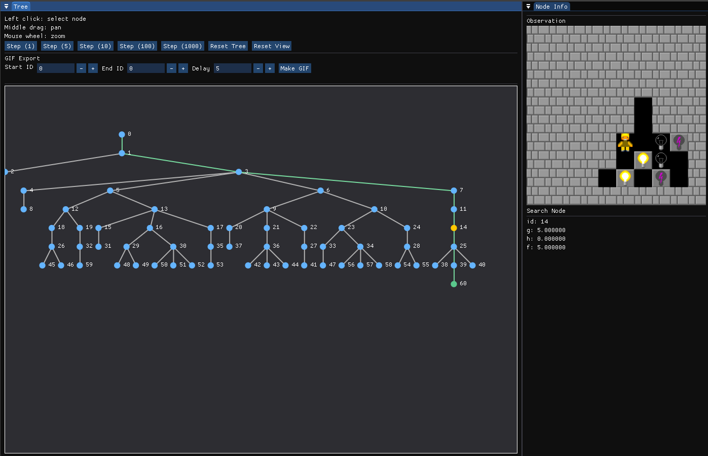
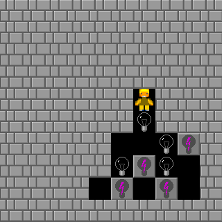

# Tree Viewer GUI

The tree viewer provides a GUI to visually interact with search algorithms, where you can:
- Incrementally build the search tree
- Zoom/Pan the tree viewer (on MacOS, you can pan by holding space or command while dragging the mouse)
- Create GIFs from any valid path in the search tree using the Node IDs
- Inspect details of each node, including a picture of the image of the represented state


We use `ImGui` with `OpenGL/GLFW` backends. 

A full example can be seen in `examples/bfs/bfs_tree_viz.cpp`.



## Usage

Each search algorithm will have different node types, and so the tree viewer requires an adapter to 
extract relevant information from each node, and the tree viewer provides callbacks to present information on screen.

An adapter first needs to satisfy the following constraint:
```cpp
// Pulls out relevant information from arbitrary node types
template <typename Adapter, typename Node>
concept TreeNodeAdapter = requires(const Adapter &a, const Node &n) {
    { a.id(n) } -> std::convertible_to<int>;                          // What is the id of the node
    { a.parent_id(n) } -> std::same_as<std::optional<int>>;           // What is the parent id (or std::nullopt for root)
    { a.action_taken(n) } -> std::same_as<int>;                       // What is the action taken for this node (can be anything for root)
    { a.label(n) } -> std::convertible_to<std::string>;               // What a label to use for this node
    { a.is_solution(n) } -> std::same_as<bool>;                       // Is this node a solution node
    // If no image support, return an empty pixel vector
    { a.image_shape(n) } -> std::same_as<std::pair<int, int>>;        // (H,W) in pixel count
    { a.get_image(n) } -> std::same_as<std::vector<std::uint8_t>>;    // Flat RGB pixel vector (H*W*3)
};
```

The `libpts::treeviz::TreeViewer` object in constructed with a `ViewerConfig` and `TreeLayoutConfig`,
which specifies the viewer layout (width, height, title, etc.) and tree layout (spacing between the levels, children, etc.) respectively.

```cpp
libpts::treeviz::TreeViewer viewer({.width = 1400, .height = 900, .title = "Minimal Tree Viewer"});
```

The viewer provides methods to query information:
- `viewer.is_open()`: Is the viewer window still open
- `viewer.reset_clicked()`: Was the reset button clicked in the last frame
- `viewer.step_amount()`: How many steps of the search has the user requested to advance by

For each `viewer.render()` call, the search tree (as a vector of nodes) is given, along with an adapter satisfying `TreeNodeAdapter`,
and a lambda function callback which given a node and a `libpts::treeviz::DetailUI`, determines what should be drawn in the 
node detail right panel. 
`libpts::treeviz::DetailUI` provides ways to draw text and fields to the panel without directl dealing with the internal drawing.

All of the supported tree search algorithms can be inserted into this.
For example,
```cpp
// Viewer
libpts::treeviz::TreeViewer viewer({.width = 1400, .height = 900, .title = "Minimal Tree Viewer"});

// Init search
auto step_bfs = bfs::BFS(search_input);
step_bfs.init();
std::vector<Node> search_nodes = step_bfs.get_tree();

// Loop for each draw call
while (viewer.is_open()) {
    // Render the current tree, with node detail information being the g, h, and f cost
    viewer.render(search_nodes, SearchNodeAdapter{}, [](const Node &n, libpts::treeviz::DetailUI &ui) {
        ui.text("Search Node");
        ui.separator();
        ui.field("id", n->id);
        ui.field("g", n->g);
        ui.field("h", n->h);
        ui.field("f", n->g + n->h);
    });
    // If the user selected to step, then step forward the search by that amount
    if (viewer.step_amount() > 0) {
        for (auto _ : std::views::iota(0, viewer.step_amount())) {
            step_bfs.step();
        }
        std::print("step clicked\n");
        search_nodes = step_bfs.get_tree();
    }
    // If the user selected to reset, then reset the search object
    if (viewer.reset_clicked()) {
        step_bfs.reset();
        step_bfs.init();
        search_nodes = step_bfs.get_tree();
        std::print("reset clicked\n");
    }
}
```

## GIFs

To create a GIF of a path, find the node IDs of the start/end of the path, and then set the GIF delay.
When you click on `Make GIF` button, it will create a `path.gif` file if successful.


